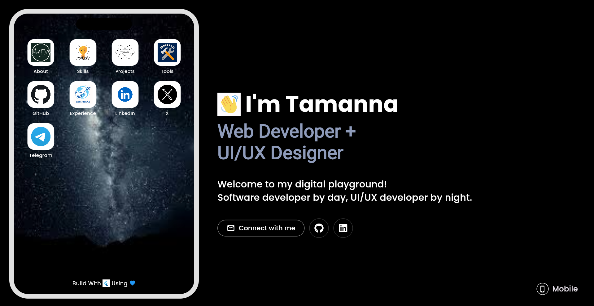

# Tamanna's Portfolio - Flutter App

Welcome to my personally built portfolio site mockup using Flutter! This project is basically for my practice of usin flutter web apps in a visually appealing and interactive way. It's designed as a template for users to create teir portfolios.



## 📂 Folder Structure

|-- assets<br>
|   |-- icons<br>
|   |   |-- about.png<br>
|   |   |-- skills.png<br>
|   |   |-- projects.png<br>
|   |-- images<br>
|   |   |-- wave_hand.gif<br>
|   |   |-- bg.jpeg<br>
|-- lib<br>
|   |-- home_screen.dart<br>
|   |-- main.dart<br>
|-- pubspec.yaml<br>

## 📋 Installation & Setup

### Clone the Repository
```git clone https://github.com/your-username/portfolio_flutter.git```
```cd portfolio_flutter```

### Install Dependencies
```flutter pub get```

### Run the App
```flutter run```

## 🔥 Customization
Feel free to personalize the following:<br>
  1. Profile Picture & Intro Text in HomeScreen<br>
  2. Icons & Labels for phone mockup apps in PhoneMockup<br>
  3. Social Links in SocialButton and SocialIconButton<br>


